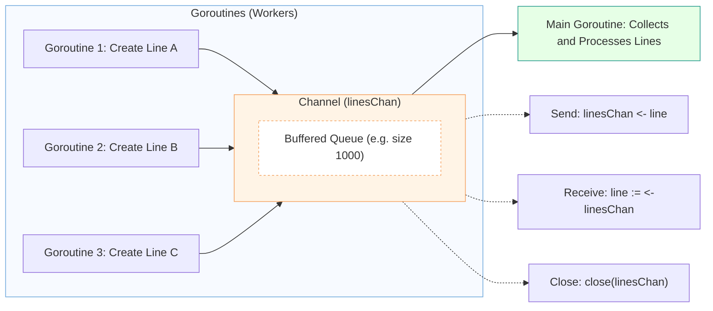
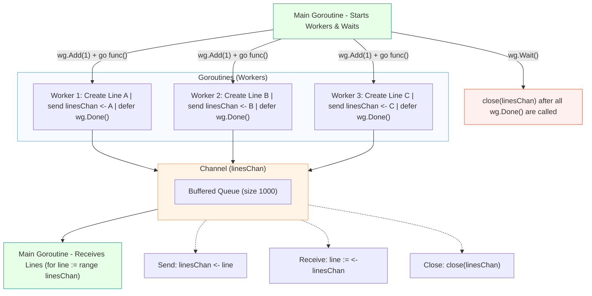

# Go Rectangles: A Performance Comparison with C#
*Learning Golang through concurrency, channels, and performance testing.*

## Introduction

After completing my [Udemy course in Golang](https://github.com/jahanalem/LinkedIn2GitHub/blob/main/0030_golang-foundations-and-microservices-plan.md), I wanted to put my new knowledge into practice. To do this, I decided to convert my C# project, `RectanglesCalculator`, into Golang (Go).

My goal was not only to rewrite the project but also to compare the performance of these two popular programming languages — C# (.NET 9) and Go — for the same computational task.

## About the Original Project (C#)

The original project, [RectanglesCalculator](https://github.com/jahanalem/RectanglesCalculator), is a program that finds all possible rectangles formed by a given set of points on a 2D plane. Each rectangle is identified when four points create two horizontal and two vertical lines that match perfectly. The algorithm must efficiently detect and count all valid rectangles, even in large datasets.

## The Performance Comparison

To test both versions, I created JSON files with a varying number of points, from a small set of 16 up to a large set of 50,000. I ran the exact same tests on both the C# and Go applications.

The results were amazing and showed a significant performance advantage for the Go version.

### The Results in Detail

The data below speaks for itself. Go runs much faster than C#, and the performance gap increases dramatically with the size of the dataset.


As you can see in the chart, the orange line for C# climbs very steeply, while the blue line for Go remains much flatter. At 50,000 points, the Go version was nearly **20 times faster** than the C# version.

## Why is Go So Much Faster?

The algorithm is identical in both projects, so the difference is not in the logic. Instead, the performance advantage comes from how Go is designed, especially in how it handles **concurrency** and **memory management**.

Here is a simple explanation:

### 1. Lightweight Concurrency (Ants vs. Elephants)

Imagine you need to move thousands of small packages.

-   **Go uses Goroutines**: Think of goroutines as a huge team of tiny, efficient ants. You can have hundreds of thousands of them, and they work together perfectly without getting in each other's way. They require very few resources and are managed with incredible efficiency.

-   **C# uses Threads**: Think of threads as powerful but heavy elephants. They are very strong, but it's slow and expensive to get them started and to manage thousands of them for small tasks. This creates a lot of overhead, which slows down the whole process.

For this project, Go's "ant colony" approach is far more effective.

### 2. Efficient Memory Management (A Shopping List vs. a Scavenger Hunt)

Imagine you need to collect several items from a store.

-   **Go uses [Structs](https://www.w3schools.com/go/go_struct.php)**: Go stores related data together in one continuous block of memory. This is like having a perfectly organized shopping list where all items are in the same aisle. The CPU can grab everything it needs in one quick trip.

-   **C# uses [Classes](https://learn.microsoft.com/en-us/dotnet/standard/design-guidelines/choosing-between-class-and-struct)**: In C#, data can be spread out across different memory locations. To get all the data for one object, the CPU has to jump from one location to another. This is like a scavenger hunt, where each clue leads to the next. All that jumping around takes time.

Go's "shopping list" approach means data is accessed much faster, which makes a huge difference.

## Conclusion

This project was a fantastic opportunity to practice my Go skills and understand how it compares to C#. While both languages are powerful, Go proved to be significantly faster and more memory-efficient for this type of computational and concurrent processing.

The results show that Go is an excellent choice for high-performance applications, especially when dealing with large amounts of data and concurrency.


---

## Learning Golang from This Project 🧠

This project is not only about performance.  
It also helped me learn Golang step by step — especially topics like **concurrency**, **WaitGroups**, **channels**, and **sync.Map**.  
Each section below explains one concept in plain English, with examples from my own code.

---


## ⚙️ Concurrency vs Parallelism

These two words — **concurrency** and **parallelism** — look similar, but they are not the same.  
Let’s understand them in a very simple way.

---

### 🧠 What is Concurrency?

**Concurrency** means *doing many things at the same time in a shared period of time.*

But it doesn’t mean that all things run exactly at the same moment.  
They just **take turns quickly** — so it feels like they happen together.

🟢 Example:  
Imagine you are cooking dinner and also chatting with a friend.  
You cut vegetables, then you check your phone, then you stir the soup.  
You are doing both tasks *in the same time frame*, but not *at the same exact moment.*

That’s **concurrency**.

In Go, **goroutines** make your program concurrent — they share CPU time efficiently.

---

### ⚡ What is Parallelism?

**Parallelism** means *doing many things at the same exact time.*

This happens when you have **multiple CPU cores**, and each core runs a different task simultaneously.

🟣 Example:  
Imagine two cooks in the kitchen.  
One is cutting vegetables while the other is boiling water — both truly at the same time.

That’s **parallelism**.

---

### 🔍 The Difference in One Sentence

| Concept | Meaning | Example |
|----------|----------|----------|
| **Concurrency** | Many tasks taking turns | One cook doing many things quickly |
| **Parallelism** | Many tasks running exactly at the same time | Two cooks working together at once |

---

### 💡 In Go

Go is designed for **concurrency first**.  
It uses **goroutines** to let tasks run together smoothly.  
If your computer has multiple CPU cores, Go can also run them **in parallel** — but that depends on your system and the Go scheduler.

✅ So:  
- **Goroutines → Concurrency**  
- **Multiple CPU cores → Parallelism**

---

## 🧩 Understanding Goroutines, WaitGroups, and Channels (Step by Step)

In Go, these tools — **goroutines**, **WaitGroups**, and **channels** — work together to make your program **concurrent**.  
They help you run many small tasks at the same time safely and efficiently.

Let’s learn each one with very simple examples.

---

### 🟢 1. What is a Goroutine?

A **goroutine** is a small, lightweight thread.  
It allows a function to run **independently** from the rest of the program.

To start a goroutine, you add the word **`go`** before a function call.

Example:
```go
go fmt.Println("Hello from a goroutine!")
```

This line will print the message **while the main program continues running**.
So, the program can do many things “at once.”

💡 **Think of it like this:**
A goroutine is like telling your helper, “Please do this task while I do something else.”

💡 **How it works inside Go:**
Goroutines are not system threads. They are managed by the **Go runtime scheduler**, which runs thousands of goroutines on a few operating system threads.
The scheduler automatically pauses and resumes them so that the CPU is always busy but never overloaded.
This is why you can easily create thousands (or even millions) of goroutines without slowing down your program.

---

### 🟣 2. What is a WaitGroup?

When you start several goroutines, your main program might finish **before** they do.
To prevent that, Go gives us a **WaitGroup** — it helps us *wait* for all goroutines to finish before continuing.

Example:

```go
var wg sync.WaitGroup // create a WaitGroup

wg.Add(1) // tell it: "we have 1 goroutine to wait for"

go func() {
    defer wg.Done() // say "I'm done" when finished
    fmt.Println("Work done!")
}()

wg.Wait() // wait until all goroutines call Done()
```

Explanation:

* `wg.Add(1)` — adds one task to the waiting list.
* `wg.Done()` — marks that task as finished.
* `wg.Wait()` — blocks (pauses) the program until all tasks are done.
* `defer` — means “run this line at the end of the function.”

💡 **Tip:**
Without `WaitGroup`, your program might end before goroutines complete their work.

💡 **Why use `defer wg.Done()` instead of calling it directly?**
Because `defer` guarantees that `wg.Done()` will run **even if the goroutine exits early** due to an error or a return.  
This makes your code safer and easier to maintain.

---

### 🟠 3. What is a Channel?

A **channel** is like a pipe that lets goroutines **send and receive data** between each other safely.

You create a channel like this:

```go
linesChan := make(chan geometry.Line, 1000)
```

Here:

* `chan geometry.Line` means the channel will carry data of type `geometry.Line`.
* The number `1000` means it’s a *buffered* channel — it can hold up to 1000 items at once.

You can:

* **Send** data into the channel using `channel <- value`  
* **Receive** data from the channel using `value := <-channel`


Example:

```go
// Send a value
linesChan <- geometry.NewLine(p1, p2)

// Receive a value
line := <-linesChan
```

💡 **Think of a channel like a mailbox:**
One goroutine puts letters inside (sending), and another takes them out (receiving).

💡 **Important:**

When you send data into an *unbuffered* channel, the sender will **wait** until another goroutine is ready to receive that data.  
This creates **automatic synchronization** between goroutines — no extra locks or mutexes are needed.

For *buffered* channels (like ours with `1000`), the sender can continue sending values **until the buffer is full**.  
Only when the buffer becomes full does the sender have to wait.

---

### 🔍 Comparison: Unbuffered vs Buffered Channels

| Type of Channel | How It Works | Synchronization Behavior | Speed & Flexibility | When to Use | Real-World Example |
|-----------------|---------------|--------------------------|---------------------|--------------|--------------------|
| **Unbuffered (`make(chan T)`)** | The sender waits until the receiver is ready to take the value. | **Strict synchronization** — both must be ready at the same time. | Slower, but ensures order and timing. | When two goroutines must work step by step together. | Handing an item **directly** from one person to another. |
| **Buffered (`make(chan T, N)`)** | The sender can keep sending until the buffer (N) is full. | **Loose synchronization** — sender and receiver can work at different times. | Faster and more flexible, but uses more memory. | When you want higher performance and can allow the sender and receiver to work at different speeds. | Dropping letters into a **mailbox**, where the receiver can pick them up later. |


💡 **Tip:**  
Choosing the right buffer size depends on your workload.  
A larger buffer allows more sending without waiting, but uses more memory.  
In this project, `1000` gives a perfect balance between speed and memory usage.

✅ **In short:**
- **Unbuffered channels** are good when you need **tight coordination** between goroutines.  
- **Buffered channels** are good when you want **speed** and can allow a small delay between sending and receiving.


---

### 🧠 4. What is `close(linesChan)`?

When no more data will be sent to a channel, we **close** it.

```go
close(linesChan)
```

This tells the receiver goroutine:
“No more data is coming. You can stop reading soon.”

If you don’t close the channel, the program may wait forever for new data.

💡 **Who should close the channel?**
Usually, the **sender** (the one who writes data into the channel) is responsible for closing it — not the receiver.  
Only close a channel when you are sure that no more data will be sent.  
Receivers should simply keep reading until the channel is closed.

---

### 🔵 5. How These Work Together in `createLinesParallel()`

Let’s look at the code and understand each part:

```go
linesChan := make(chan geometry.Line, 1000)
var wg sync.WaitGroup

for _, group := range pointsByY {
    if len(group) < 2 {
        continue
    }
    wg.Add(1) // one goroutine starts

    go func(g []geometry.Point) {
        defer wg.Done() // mark as done when finished
        for i := 0; i < len(g); i++ {
            for j := i + 1; j < len(g); j++ {
                // send line into the channel
                linesChan <- geometry.NewLine(g[i], g[j])
            }
        }
    }(group)
}

// another goroutine closes the channel when all done
go func() {
    wg.Wait()      // wait for all goroutines
    close(linesChan) // close the channel
}()
```

#### Explanation (in simple words):

1. `linesChan` — a shared mailbox where all goroutines put their results.
2. `wg.Add(1)` — says “we’re starting one new worker.”
3. `go func(...)` — starts the worker in the background.
4. `defer wg.Done()` — tells the WaitGroup when that worker finishes.
5. `linesChan <- geometry.NewLine(...)` — sends a line into the mailbox.
6. Another goroutine waits for all workers to finish (`wg.Wait()`), then **closes the mailbox** (`close(linesChan)`).

---

### 🧩 6. What Happens in Simple Steps

1. Many goroutines start working on different groups.
2. Each goroutine sends its results (lines) into the shared channel.
3. The main goroutine collects all lines from that channel.
4. When all workers finish, the channel closes.
5. The program continues safely — no lost data, no waiting forever.

---

### ✅ In One Sentence

> **Goroutines** make Go concurrent,
> **WaitGroups** help control them,
> and **Channels** let them talk safely.

Together, they make Go programs fast, efficient, and easy to manage — like a **team of workers sharing one smart mailbox**.


---
## 🧩 Understanding `sync.Map` in Go

When many goroutines work together, sometimes they all need to **read and write to the same map**.  
But normal Go maps are **not safe for concurrent use** — this means if two goroutines try to change a map at the same time, the program can crash.

To solve this, Go gives us a special type called **`sync.Map`** from the `sync` package.

---

### 🧠 1. What is `sync.Map`?

`sync.Map` is a **thread-safe map** — this means many goroutines can read and write to it **at the same time**, safely.

You don’t need to use `mutex` (locks) yourself.  
Go handles all the synchronization inside `sync.Map`.

---

### ⚙️ 2. How to Create It

You create it like this:
```go
var rectsMap sync.Map
```

Now `rectsMap` is ready to use.
It’s like a normal map, but with special methods for concurrency.

---

### 🔧 3. How to Use It

#### 🟢 Store (add or update a value)

```go
rectsMap.Store("key1", "Rectangle A")
```

This adds a new key–value pair to the map.

If the key already exists, the value is updated.

---

#### 🔵 Load (get a value)

```go
value, ok := rectsMap.Load("key1")
if ok {
    fmt.Println("Found:", value)
} else {
    fmt.Println("Not found")
}
```

* `ok` is a boolean (true/false) that tells if the key exists.
* `value` is the stored data.

---

#### 🟣 Delete (remove a value)

```go
rectsMap.Delete("key1")
```

This removes the key and its value from the map.

---

#### 🟠 Range (loop through all items)

```go
rectsMap.Range(func(key, value any) bool {
    fmt.Println("Key:", key, "Value:", value)
    return true // return false to stop looping early
})
```

`Range` lets you go through all items in the map.
You return `true` to keep looping, or `false` to stop early.

---

### 🧩 4. Example from the Project

In `findRectanglesParallel()` function:

```go
rectsMap := sync.Map{} // Thread-safe map to store rectangles

// inside goroutines:
rectsMap.Store(rect.ToKey(), rect)
```

Explanation:

* Many goroutines find rectangles at the same time.
* Each goroutine calls `rectsMap.Store(...)` to save its rectangle.
* Because `sync.Map` is safe, they can all write without problems.

At the end:

```go
rectsMap.Range(func(key, value interface{}) bool {
    finalRects = append(finalRects, value.(*geometry.Rectangle))
    return true
})
```

This collects all rectangles from the map into a slice.

---

### 💡 5. Why Use `sync.Map` Instead of a Normal Map?

| Feature                    | `map`                | `sync.Map`           |
| -------------------------- | -------------------- | -------------------- |
| Thread-safe                | ❌ No                 | ✅ Yes                |
| Needs locks (`sync.Mutex`) | ✅ Yes                | ❌ No                 |
| Easy for concurrent access | ❌ No                 | ✅ Yes                |
| Best for                   | single-threaded code | multi-goroutine code |

---

### 🧠 6. When to Use It

Use `sync.Map` when:

* Many goroutines must share data at the same time.
* You don’t want to manually manage locks.
* You care more about **convenience and safety** than absolute speed.

Don’t use it for small, single-threaded programs — a normal map is faster there.

---

### ✅ Summary

| Method                             | What It Does           |
| ---------------------------------- | ---------------------- |
| `Store(key, value)`                | Add or update an item  |
| `Load(key)`                        | Read an item           |
| `Delete(key)`                      | Remove an item         |
| `Range(func(key, value any) bool)` | Loop through all items |

🟢 In short:

> **`sync.Map` is a safe shared storage** for goroutines —
> it lets many workers read and write data at the same time **without crashing**.

---

⚠️ **Common Mistakes for Beginners**

1. Forgetting to use `wg.Wait()` — the program finishes before goroutines complete.  
2. Forgetting to close a channel — the program waits forever for more data.  
3. Writing to a closed channel — causes a panic (runtime error).  
4. Using the same variable inside multiple goroutines without passing it as a parameter.

---

Perfect request, Roohi 🌿
What you’re asking for is exactly what many developers wish they had when learning Go concurrency — not just “what” but **“why”**.

Below is your full English explanation — rewritten in **clear, simple, B2-level English**, easy to read and understand.
It combines all the earlier explanations and diagrams into **one complete, story-based and visual section** that fits beautifully in your GitHub documentation.

---

# 🧩 Understanding Channels in Go (Deep but Simple)

When I first learned about **channels** in Go, I was confused too.
I saw data being sent *into* a channel and then *received* again later, and I wondered:

> “Why do we put data into a channel? What happens to it? Why not just use a slice or a list?”

Let’s understand this step by step, in a clear and visual way.

---

## 🚧 Without Channels — A Big Problem

Imagine you have **10 workers (goroutines)**, and each one is building a small piece of data — for example, a line between two points.
You want to collect all these lines into one big list.

If every goroutine tries to write to the same list at the same time like this:

```go
lines = append(lines, newLine)
```

you will have a problem!
Two or more goroutines could write to the list at the same moment — and the program may **crash or produce wrong data**.
You could use locks (`sync.Mutex`) to prevent that, but it’s complex and error-prone.

---

## 📦 What Channels Really Do

A **channel** in Go is a **safe path for sending data** between goroutines.
It’s like a **queue** or a **mailbox** where data moves safely, one by one.

Each goroutine can simply send its result into the channel:

```go
linesChan <- newLine
```

And in another place, the main goroutine can receive them:

```go
for line := range linesChan {
    allLines = append(allLines, line)
}
```

✅ The data doesn’t change inside the channel.
It’s not processed or modified — it’s just **passed safely** from one goroutine to another.
Go handles the timing, order, and synchronization for you.

---

## 🧠 What Happens to the Data?

When you send data to a channel:

1. The goroutine creates a new value (for example, a `geometry.Line`).
2. It **sends** it into the channel using `<-`.
3. The channel **stores** it temporarily in a queue (especially if it’s buffered).
4. Another goroutine **receives** it later using `<-channel`.

The data before and after the channel is **the same** — Go just ensures it moves safely and in the correct order.

---

## 🔐 Why Channels Are Better Than Shared Lists

| Feature                   | Shared Slice/List | Channel                      |
| ------------------------- | ----------------- | ---------------------------- |
| Safe for concurrent use   | ❌ No              | ✅ Yes                        |
| Needs lock (Mutex)        | ✅ Yes             | ❌ No                         |
| Maintains order           | ❌ Not guaranteed  | ✅ FIFO (First In, First Out) |
| Automatic synchronization | ❌ No              | ✅ Yes                        |
| Easy to manage            | ❌ Hard            | ✅ Very easy                  |

So, instead of using many locks or waiting manually,
you just use channels — and Go does all the synchronization automatically.

---

## 🧩 Visual: How Channels Work

Here’s a simple diagram showing how data flows through a channel.



### 💬 Explanation

Each goroutine produces data and sends it into the channel.
The main goroutine receives the data one by one and processes them safely.
The channel guarantees that everything happens in order and without conflict.

---

## ⚙️ Channels + WaitGroup + Goroutines Together

In real projects (like this one), you often use **three tools together**:

1. **Goroutines** – run multiple tasks at the same time.
2. **WaitGroup** – wait for all tasks to finish.
3. **Channel** – safely collect and share the results.

Here’s a full diagram of how they work together 👇



---

## 🧩 Understanding Goroutines, WaitGroups, and Channels (Step-by-Step)

1. **Main goroutine** starts multiple workers.
   Before each worker starts, it tells the WaitGroup:

   ```go
   wg.Add(1)
   ```

2. Each **worker (goroutine)** does its job, sends results into the channel:

   ```go
   linesChan <- geometry.NewLine(...)
   ```

   and says “I’m done” at the end:

   ```go
   defer wg.Done()
   ```

3. **Main goroutine** reads from the channel:

   ```go
   for line := range linesChan {
       ...
   }
   ```

4. When all workers are finished, the WaitGroup count goes to zero.
   Then the main goroutine closes the channel:

   ```go
   wg.Wait()
   close(linesChan)
   ```

Now the main goroutine knows that all results are collected safely.

---

## ✨ Analogy You’ll Never Forget

| Concept            | Real-World Analogy                                        |
| ------------------ | --------------------------------------------------------- |
| **Goroutine**      | A worker in a factory                                     |
| **WaitGroup**      | A checklist to ensure all workers are finished            |
| **Channel**        | A conveyor belt carrying products safely                  |
| **close(channel)** | Turning off the conveyor belt after all products are done |

---

## ✅ Final Summary

> Channels in Go don’t change your data —
> they **transport** it safely between goroutines,
> ensuring there’s no data conflict, no race condition, and no need for locks.

That’s why Go’s concurrency model feels so elegant:
**simple, efficient, and predictable** — even when thousands of goroutines run at once.


---


## 📚 Further Reading & References

### 🧩 For Go Concurrency
- [Go by Example: Goroutines](https://gobyexample.com/goroutines) — simple examples of how goroutines work in practice.  
- [Effective Go: Concurrency](https://go.dev/doc/effective_go#concurrency) — official Go guide explaining concurrency patterns.  
- [Go Blog: Concurrency is not Parallelism](https://go.dev/blog/waza-talk) — classic article clarifying the key difference between concurrency and parallelism.

### ⚙️ For Performance Characteristics
- [Go GC: Latency Mode](https://tip.golang.org/doc/gc-guide) — official guide to Go’s garbage collector and performance tuning.  
- [Understanding Go Sync Package](https://pkg.go.dev/sync) — documentation for Go’s synchronization primitives, including WaitGroup and sync.Map.

---

🚀 This project helped me understand how Go’s concurrency model really works in practice — not just theory.  
It showed me how concepts like **goroutines**, **channels**, and **WaitGroups** can build powerful, scalable programs.

